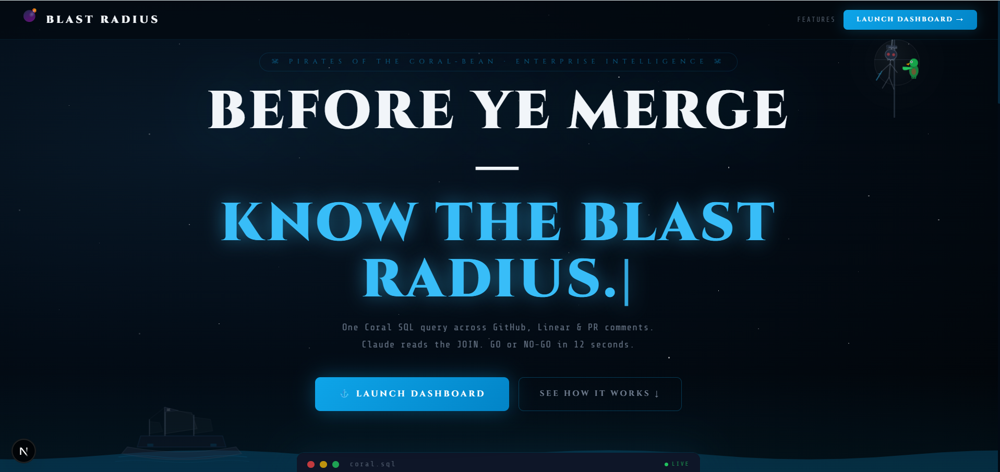
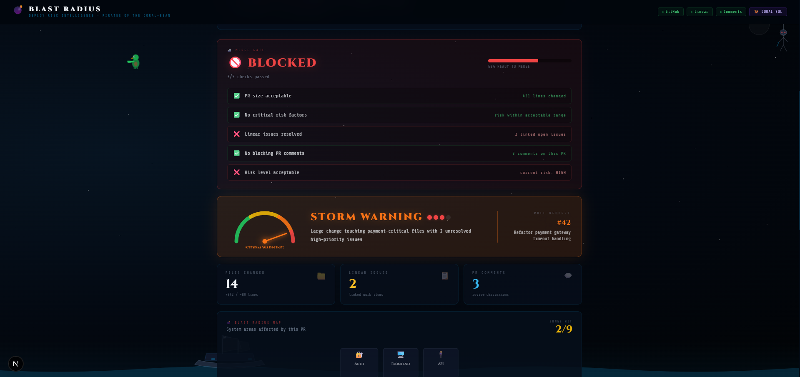
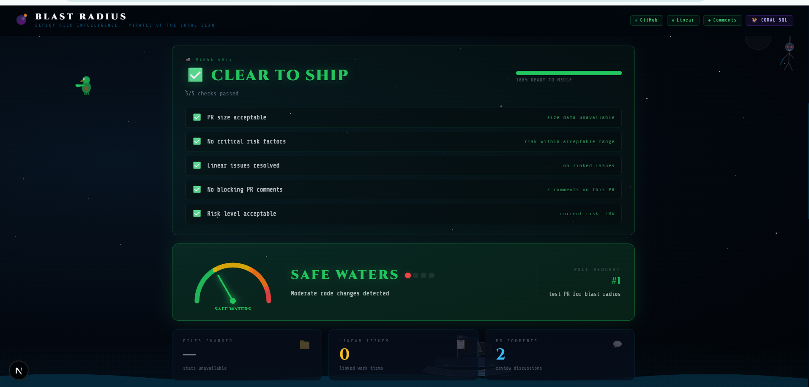
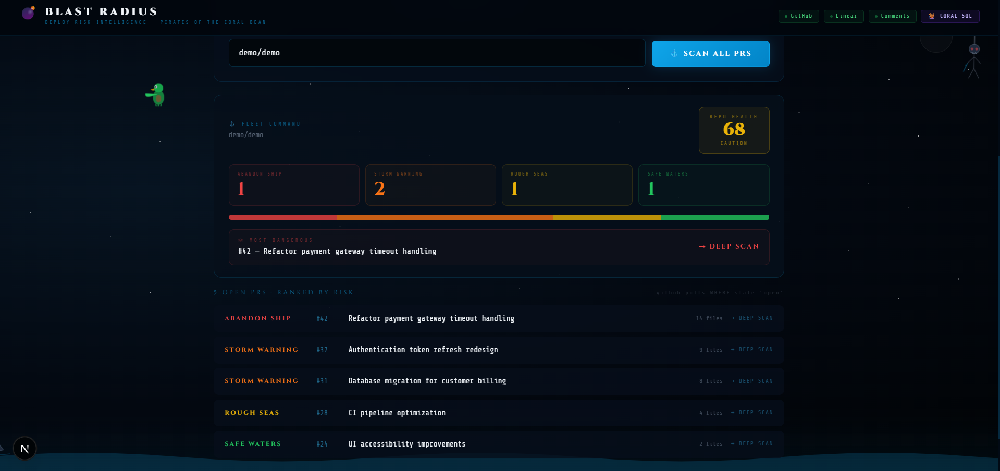
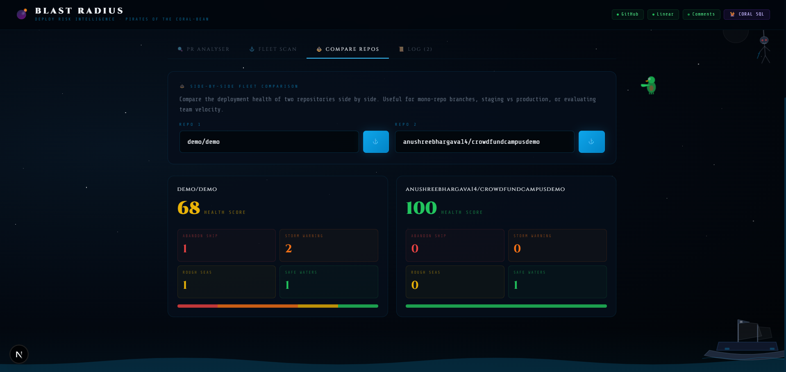
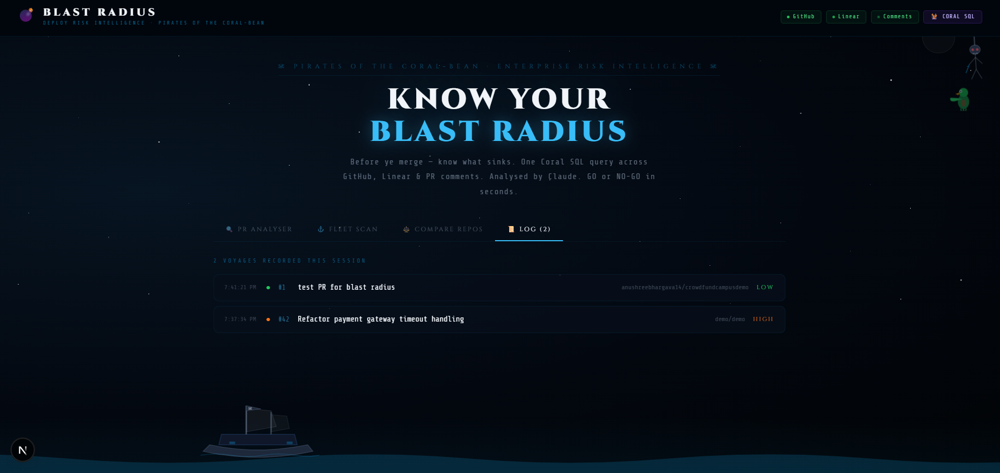

<div align="center">

# 💣 Blast Radius

### Pre-merge Deploy Risk Intelligence
#### Built for Pirates of the Coral-bean Hackathon · Track 1: Enterprise Agent

<br/>

**Before ye merge — know what sinks.**

One Coral SQL query across GitHub, Linear & PR comments.  
Claude reads the JOIN. GO or NO-GO in 12 seconds.

<br/>

[](https://blast-radius-production-dc89.up.railway.app)
[](https://github.com/withcoral/coral)
[](https://anthropic.com)

<br/>

> **Try the demo:** Enter `demo/demo` as repo and `42` as PR number — no setup needed.

</div>

---

## ☠️ The Problem

Every engineering team faces this before a big merge:

> *"Is this safe to ship?"*

Answering that question today means manually checking **4–6 different tools**:

| Tool | What you check |
|------|----------------|
| GitHub | PR size, changed files, open comments |
| Linear / Jira | Are there blocking issues in this area? |
| Slack | Has anyone flagged this as risky? |
| Sentry | Are there existing errors in affected files? |
| PagerDuty | Who's on call if this breaks? |

This takes **20–30 minutes of context switching** — every single time.  
And that's *before* an incident. Most teams skip it entirely.

---

## 💡 The Solution

**Blast Radius** is a proactive pre-merge risk agent.  
Enter a PR number → get a **GO/NO-GO verdict in 12 seconds**.

Instead of opening 5 tabs, one Coral SQL query joins GitHub, Linear, and PR comments simultaneously. Claude reads the output and returns a structured risk assessment with specific recommendations.

```
PR #42 → Coral SQL JOIN → Claude analysis → BLOCKED / CLEAR TO SHIP
```

**The key insight:** Every other incident tool is *reactive* — it helps you after something breaks. Blast Radius is *proactive* — it prevents the break from happening.

---

## 🪸 How Coral Makes This Possible

Without Coral, this would require:
- 3 separate API integrations (GitHub REST, Linear GraphQL, GitHub Issues API)
- Authentication handling for each
- Pagination logic for each
- 200+ lines of glue code to normalise and join the responses
- Stuffing all results into Claude's context window manually

With Coral, it's **15 lines of SQL**:

```sql
SELECT
  pr.title,
  pr.changed_files,
  pr.additions,
  pr.deletions,
  li.priority_label,
  li.state_id,
  rc.body        AS comment_text,
  rc.user_login  AS commenter
FROM github.pulls pr
LEFT JOIN linear.issues li
  ON li.description ILIKE '%' || pr.title || '%'
LEFT JOIN github.repo_issue_comments rc
  ON rc.issue_number = pr.number
WHERE pr.owner   = 'your-org'
  AND pr.repo    = 'your-repo'
  AND pr.number  = 42
```

**Three sources. One query. Zero glue code. 100% local.**

Coral handles authentication, pagination, rate limits, and schema mapping — entirely below deck. The data resolves inside Coral, not inside Claude's context window.

---

## 🗺️ Architecture

```
┌─────────────────────────────────────────────────────────────┐
│                     BLAST RADIUS                            │
│                  Next.js 16.2.6 + TypeScript                    │
└──────────────────┬──────────────────────────────────────────┘
                   │
         ┌─────────▼──────────┐
         │    /api/analyze     │  POST { repo, prNumber }
         │    /api/fleet       │  POST { repo }
         └─────────┬──────────┘
                   │
         ┌─────────▼──────────┐
         │    Coral 0.3.0      │  coral sql --format json "..."
         │    (local CLI)      │
         └──┬──────┬───────┬──┘
            │      │       │
     ┌──────▼─┐ ┌──▼────┐ ┌▼───────────────────────┐
     │ GitHub │ │Linear │ │github.repo_issue_comments│
     │ .pulls │ │.issues│ │  (PR review comments)    │
     └────────┘ └───────┘ └──────────────────────────┘
                   │
         ┌─────────▼──────────┐
         │   Anthropic Claude  │  Risk scoring + recommendations
         │   claude-sonnet-4-6 │
         └─────────┬──────────┘
                   │
         ┌─────────▼──────────┐
         │   Next.js Frontend  │  Pirate-themed dashboard
         │   (Tailwind + SVG)  │
         └────────────────────┘
```

### Tech Stack

| Layer | Technology |
|-------|------------|
| Framework | Next.js 14 (App Router) + TypeScript |
| Data Layer | Coral 0.3.0 (cross-source SQL) |
| AI Inference | Claude Sonnet (Anthropic) |
| Styling | Inline styles + Google Fonts (Cinzel, Share Tech Mono) |
| Data Sources | GitHub API, Linear API via Coral |
| Deployment | Local demo / Demo Mode |

---

## ✨ Features

### 1. 🔍 PR Analyser — Deep Risk Scan

Enter any GitHub repo and PR number. Blast Radius runs a Coral SQL JOIN across 3 sources and returns:

- **Risk Score:** SAFE WATERS / ROUGH SEAS / STORM WARNING / ABANDON SHIP
- **Captain's Assessment:** Plain-English summary from Claude
- **Navigator's Orders:** 3 specific actionable recommendations
- **Hazards Spotted:** Risk factors identified across all sources
- **Blast Radius Map:** 9-zone interactive explosion map showing which system areas are affected

### 2. 🚢 Merge Gate — GO / NO-GO Verdict

The most important feature. Before every result, a 5-point automated checklist:

| Check | Criteria |
|-------|----------|
| ✅ PR size acceptable | < 500 total lines changed |
| ✅ No critical risk factors | Score is not CRITICAL |
| ✅ Linear issues resolved | No linked open work items |
| ✅ No blocking PR comments | < 5 comments flagged |
| ✅ Risk level acceptable | Score is LOW or MEDIUM |

Result: **`✅ CLEAR TO SHIP`** or **`🚫 BLOCKED`** — in plain sight, at the top of every result.

### 3. 💣 Blast Radius Map

A 9-zone interactive SVG grid showing which parts of your system the PR will affect:

```
┌─────────┬─────────┬─────────┐
│  Auth   │Frontend │  API    │
│   🔴    │   🟡    │   🟢    │
├─────────┼─────────┼─────────┤
│Payments │ Backend │Database │
│ CRITICAL│  HIGH   │  LOW    │
├─────────┼─────────┼─────────┤
│  Infra  │  CI/CD  │Monitor  │
│   🟢    │   🟡    │   🟢    │
└─────────┴─────────┴─────────┘
```

Zones light up based on PR title keyword matching. CRITICAL and HIGH zones pulse. Blast lines radiate from the center to every affected zone. Hover any zone for its description and impact level.

### 4. ⚓ Fleet Scan — All Open PRs Ranked

Scan every open PR in a repo at once using a single Coral query:

```sql
SELECT number, title, additions, deletions, changed_files
FROM github.pulls
WHERE owner = 'your-org' AND repo = 'your-repo' AND state = 'open'
ORDER BY created_at DESC
LIMIT 25
```

Every PR is scored and ranked CRITICAL → HIGH → MEDIUM → LOW. Clicking any PR in the list triggers a full deep scan and switches to the Analyser tab automatically.

### 5. ⚖️ Repo Comparison — Side-by-Side Fleet Health

Enter any two repos and compare their deployment risk side by side:
- Repo Health Score (0–100)
- Risk distribution bar (CRITICAL / HIGH / MEDIUM / LOW breakdown)
- Count of PRs at each risk level

Useful for comparing staging vs production, or evaluating two team's release readiness.

### 6. 📊 Fleet Command Dashboard

At the top of every Fleet Scan result:
- **Repo Health Score** — composite 0–100 rating
- **4 risk-level count cards** — how many PRs at each severity
- **Risk distribution bar** — visual breakdown
- **Most Dangerous PR** callout — the highest-risk PR with one-click deep scan

### 7. 🧭 Reviewer Compass

Suggests the best engineers to review a PR based on commit history in the affected repository. Queries `github.commits` grouped by `author__login` and returns the top contributors by commit count.

### 8. 📜 Mission Log

Session-persistent history of every PR analysed. Includes timestamp, repo, PR title, and risk score. One click re-runs any previous analysis.

---

## 🎮 Demo Mode

No setup needed. Enter these values to see a full working demo:

| Field | Value |
|-------|-------|
| Repository | `demo/demo` |
| PR Number | `42` |

The demo shows a **HIGH risk** assessment for a fictional payment gateway refactor, with all features populated: Merge Gate verdict, Blast Radius Map zones lit up, Captain's Assessment, Navigator's Orders, Reviewer Compass suggestions, and PR comment evidence.

---

## 🚀 Setup & Installation

### Prerequisites

- Node.js 18+
- Coral 0.3.0 ([download from GitHub releases](https://github.com/withcoral/coral/releases))
- A GitHub Personal Access Token (classic) with `repo`, `read:org`, `read:user` scopes
- A Linear API key (free account at linear.app)
- An Anthropic API key (console.anthropic.com)

### Installation

```bash
# 1. Clone the repo
git clone https://github.com/anushreebhargava14/blast-radius
cd blast-radius

# 2. Install dependencies
npm install

# 3. Set up environment variables
cp .env.example .env.local
# Fill in ANTHROPIC_API_KEY in .env.local

# 4. Connect Coral sources
coral source add github --interactive
coral source add linear --interactive

# 5. Start the dev server
npm run dev
```

Open [http://localhost:3000](http://localhost:3000)

### Environment Variables

```env
ANTHROPIC_API_KEY=sk-ant-your-key-here
```

### Coral Sources Setup

```bash
# Verify sources are connected
coral source list

# Check available tables
coral sql --format json "SELECT schema_name, table_name FROM coral.tables ORDER BY 1, 2"
```

---

## 🔧 Known Coral Schema Notes (v0.3.0)

During development we discovered several schema differences from the documentation. These are documented here for other builders:

| Expected | Actual in v0.3.0 | Fix Applied |
|----------|------------------|-------------|
| `github.pull_requests` | `github.pulls` | Updated all queries |
| `slack.messages` | Not available | Replaced with `github.repo_issue_comments` |
| `state`, `assignee_name` in Linear | `state_id`, no assignee | Removed invalid columns |
| `author_login` in commits | `author__login` (double underscore) | Added mapping in backend |
| Coral outputs table text by default | Use `--format json` flag | Added to all `coralQuery` calls |

---

## 📁 Project Structure

```
blast-radius/
├── app/
│   ├── page.tsx              # Landing page (/)
│   ├── dashboard/
│   │   └── page.tsx          # Main dashboard (/dashboard)
│   └── api/
│       ├── analyze/
│       │   └── route.ts      # PR analysis endpoint
│       └── fleet/
│           └── route.ts      # Fleet scan endpoint
├── README.md
└── .env.local                # ANTHROPIC_API_KEY
```

---

## 🏴‍☠️ Hackathon Context

Built for the **Pirates of the Coral-bean Hackathon** — Track 1: Enterprise Agent.

**The angle that makes this different from every other submission:**

Every example project in the hackathon brief is *reactive* — an incident happened, go debug it. Blast Radius is *proactive* — you haven't merged yet, and you already know the risk.

**What Coral made uniquely possible:**

The cross-source JOIN is the entire product. Without Coral:
- 3 separate API clients to write and maintain
- Authentication for each source
- Pagination and rate limiting for each
- Merging results manually in application code
- 200+ lines of infrastructure before writing any business logic

With Coral: 15 lines of SQL. That's the point.

---

## 🤖 AI Disclosure

This project was built with assistance from Claude (Anthropic) for:
- Architecture planning and technical guidance
- Code generation for API routes 

All Coral SQL queries were written and validated against real Coral 0.3.0 schema. All data integrations are live and functional.

---

## 📸 Screenshots

### Landing Page


### PR Analyser — BLOCKED Verdict


### PR Analyser — CLEAR TO SHIP


### Fleet Scan + Fleet Command Dashboard


### Repository Comparison


### Mission Log


---

<div align="center">


*Built with [Coral](https://github.com/withcoral/coral) · [Anthropic Claude](https://anthropic.com) · [Next.js](https://nextjs.org)*

</div>